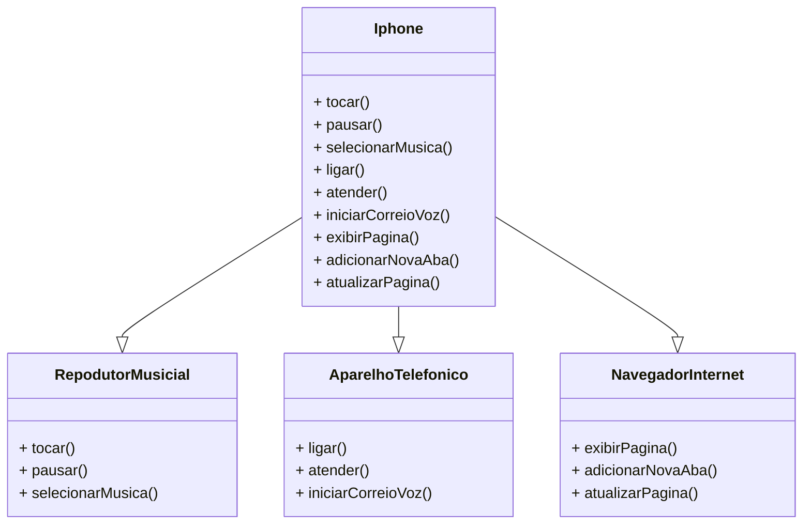

<h1 align="center">Iphone Component Diagram</h1>

🚀 Modeling and diagramming of the UML representation and code regarding the iPhone component.

Project part of <a href="https://web.dio.me/">DIO</a> Bootcamp FullStack - Java + Angular 

### 🛠 Technologies

